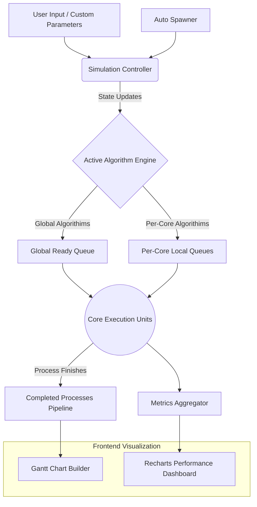

# Project Report: Interactive Multi-Core CPU Scheduling Simulator

---

## 1. Project Overview
The **Interactive Multi-Core CPU Scheduling Simulator** is a high-performance, dynamic web application designed to visually demonstrate how operating systems handle process scheduling across multiple processor cores. The primary goal of the project is to provide an educational sandbox that bridges the gap between theoretical operating system concepts and real-world execution. 

Its scope extends beyond traditional single-core models, offering real-time visualization of both global algorithms (e.g., First Come First Serve, Round Robin) and advanced per-core, load-balancing heuristics (e.g., Work Stealing, Push/Pull Migration, Completely Fair Scheduler). The expected outcome is a functional, interactive platform where users can dynamically spawn CPU bursts, change algorithms on the fly, and analyze system throughput and utilization variances via live charts.

---

## 2. Module-Wise Breakdown
The project architecture is constructed using a decoupled, reactive approach, divided into three core modules:

**Module 1: Simulation Engine & State Controller**
The backbone of the application. It acts as the system clock, advancing the simulation continuously while maintaining the state of the global queue, individual core assignments, process life-cycles (Arrival, Ready, Running, Terminated), and algorithm-specific logic regarding context switching and time quantums.

**Module 2: Interactive GUI & Process Visualizer**
The front-end user interface responsible for dynamically rendering the underlying system state. This module orchestrates the visual representation of active CPU cores, pending queues, and historical execution timelines (Gantt Charts) using smooth layout transitions.

**Module 3: Analytics & Benchmarking**
A dedicated subsystem tracking historical execution metrics. It captures throughput, average response times, process wait times, task migration counts, and CPU utilization balance across the multi-core environment, presenting them as an interactive 2×2 benchmarking grid.

---

## 3. Functionalities

**Simulation Engine:**
- **Dynamic Scheduling:** Capable of running 8 distinct algorithms ranging from Round Robin to CPU Affinity.
- **Auto-Spawning Mechanics:** Procedurally generates realistic user workloads dynamically over time.
- **Load Balancing Logic:** Employs algorithms like *Work Stealing* to dynamically distribute loads from overworked kernels to idle cores.

**GUI & Process Visualizer:**
- **Per-Core Dashboards:** Live display of CPU utilization percentages, currently running processes, and exact queue lengths.
- **Gantt Chart Timeline:** An animated timeline tracking the last 30 completed processes, including detailed tooltips displaying Time spent waiting and specific core assignments.
- **Custom Parameter Entry:** Allows users to inject manually defined processes specifying exact burst times, arrival times, and priorities.

**Analytics & Benchmarking:**
- **Live Line Charts:** Plots CPU Utilization Balance, Response Time, Throughput, and Migration Overhead.
- **Real-Time Data Aggregation:** Calculates algorithmic efficiency precisely every few milliseconds.

---

## 4. Technology Used

- **Programming Languages:**
  - TypeScript (Strict-typed JavaScript)
  - HTML5 & CSS3 (Custom styling and CSS-based variables)

- **Libraries and Tools:**
  - **Framework:** React 19 (via Vite) for declarative, component-based UI engineering.
  - **Styling:** Tailwind CSS v4 for rapid, responsive layout creation.
  - **Visualization Data:** Recharts for optimized SVG-based line charts.
  - **Animations:** Framer Motion for calculating fluid layout shifts and queued block transitions.
  - **Icons:** Lucide-React.

- **Other Tools:**
  - Git & GitHub (For version control and CI/CD tracking).
  - Node.js (Vite Development Server environment).

---

## 5. Flow Diagram

---

## 6. Revision Tracking on GitHub
- **Repository Name:** Multi-Core-Load-Balancing-Scheduler
- **GitHub Link:** [https://github.com/Syed-arsh-09/Multi-Core-Load-Balancing-Scheduler](https://github.com/Syed-arsh-09/Multi-Core-Load-Balancing-Scheduler)

---

## 7. Conclusion and Future Scope
The Interactive Multi-Core CPU Scheduling Simulator successfully implements complex scheduling theories into an approachable, real-time GUI environment. Through precise React hook mechanics and an event-driven architecture, the project efficiently balances performance and rich visual aesthetics.

**Future Scope:**
- Integration of specialized thread-level concurrency simulations, addressing issues like race conditions, memory locks, and mutexes.
- Network simulation capabilities to simulate distributed systems or cloud clusters alongside singular system multithreading.
- Export functionality allowing users to download analytical logs as CSV format for academic benchmarking.

---

## 8. References
- *Operating System Concepts* by Abraham Silberschatz, Peter B. Galvin, and Greg Gagne.
- React Documentation: [https://react.dev/](https://react.dev/)
- Recharts Data Visualization: [https://recharts.org/](https://recharts.org/)

---

## Appendix

### A. AI-Generated Project Elaboration/Breakdown Report

**1. Project Overview**
The objective of the "Interactive Multi-Core CPU Scheduling Simulator" is to build an educational data-visualization web application mapping Operating System process scheduling inside modern multi-core processors. The scope addresses multiple CPU scheduling algorithms (both single collective queues and distributed local queues) to let users observe system throughput, wait times, and core utilization in real-time. Expected outcomes include a functional sandbox where varied loads are tested against algorithms like Work Stealing, Shortest Job First, and Round Robin.

**2. Module-Wise Breakdown**
- **Simulation/State Module:** The mathematical core. It evaluates ticks based on designated algorithms, handles context switching, tracks total simulation time, and routes processes to available cores.
- **GUI Operations Module:** The visualization interface. It provides end-users the tools to dictate time quantums, inject manual procedures, toggle auto-spawning modes, and visually view each core's dedicated readiness queues.
- **Data Analytics Module:** The statistics center. Generates historical traces comparing metrics like CPU variance over time and relative throughput to provide verifiable comparisons.

**3. Functionalities**
- *Simulation:* Tracks granular details like Time-In-Quantum, remaining burst times, and priority thresholds. Reallocates workload dynamically under the `PUSH_PULL` strategy.
- *GUI Operations:* Configurable parameters (ex: modifying multi-core scaling from 2 up to 16 cores), Gantt chart plotting with exact execution timestamps.
- *Data Analytics:* Responsive line graphs that maintain history and allow hovering for exact point-in-time crosshair inspection.

**4. Technology Recommendations**
- **Languages:** JavaScript/TypeScript (ideal for web-based timeline environments), HTML/CSS.
- **Libraries:** React (Component decoupling), Tailwind CSS (Rapid styling), Recharts/Chart.js (Robust graph drawing), Framer Motion (Interpolated physics-based animations between DOM elements).
- **Tools:** Vite (Fast module bundling), Node.js, Git for collaborative tracking.

**5. Execution Plan**
- *Step 1 (Foundations):* Setup Vite environment with React + TypeScript. Configure TailwindCSS directives. 
- *Step 2 (The Engine):* Construct a central `useSimulation` React Hook capable of generating a standardized ticking loop (`setInterval`) and a standard `Process` interface definition.
- *Step 3 (Algorithms):* Implement logic pathways starting with basic structures (FCFS, RR) and moving to heuristic models (CFS, Load Balancing).
- *Step 4 (UI Building):* Map array outputs into distinct Core Visualizers, leveraging modern CSS to handle transition complexities.
- *Step 5 (Analytics Integration):* Connect internal metric tallies to Recharts data models. Ensure UI bounds respect resize dimensions without overflow layout shifts.
- *Step 6 (Polishing):* Inject tooltip interactions, responsive adjustments, and deploy to version control. Let the UI focus on dark modes or specific aesthetic themes for educational engagement.

---

### B. Problem Statement
**Interactive Multi-Core CPU Scheduling Simulator**

---

### C. Solution/Code
The entire source code is available in the collaborative GitHub repository under the MIT license. 
Primary simulation logic is centered inside the hook `src/hooks/useSimulation.ts`, representing the core operational payload. The centralized UI assembly is located within `src/components/Dashboard.tsx`.

*For complete implementation code structures, architecture graphs, and build pipelines, please reference the GitHub repository linked in Section 6.*
